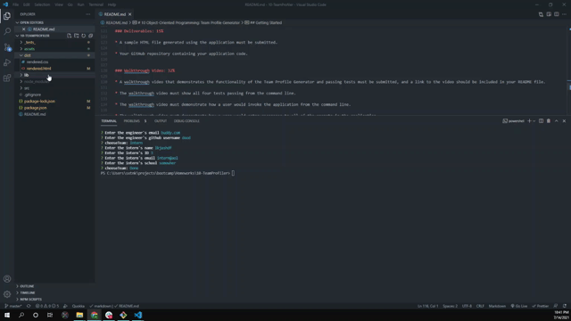
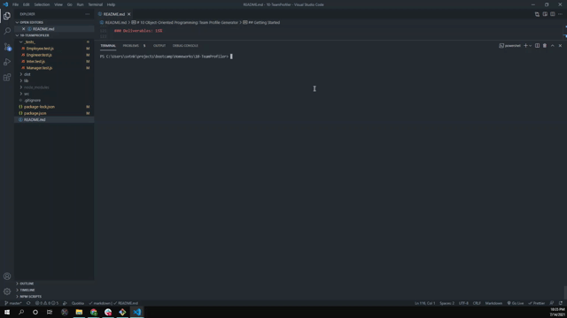

# 10 OOP: Team Profile Generator

Homework which requires you to use OOP to generate a team profile from CLI inputs. This app will run with the command
\`\`\`
npm run run
\`\`\`
and will feature dynamically updated HTML powered by Bootstrap, JavaScript, and OOP. Technical challenges include:

- DOM manipulation
- OOP
- OOP Testing
- Inquirer
